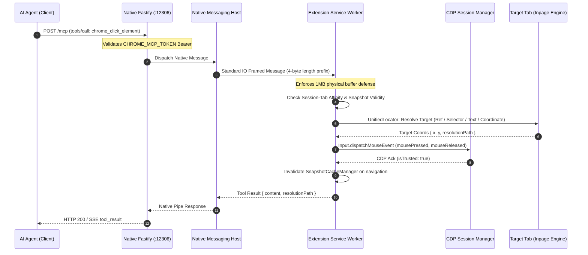

# BrowserClaw (mcp-chrome) Architecture & System Design 🏗️

> **Version**: 2.0.0 (Boost Hardened Release)  
> **Target Runtime**: Chrome Extension Manifest V3, Chrome DevTools Protocol (CDP 1.3), Model Context Protocol (MCP 2024-11-05), Fastify HTTP/SSE, Chrome Native Messaging.

---

## 1. System Overview & Architecture Topology

BrowserClaw connects AI Agents (Claude Desktop, Cursor, Cline, OpenManus, AutoGPT) directly to an active, authenticated Google Chrome instance through the **Model Context Protocol (MCP)**. Unlike traditional headless browser frameworks (Playwright, Puppeteer, Selenium), BrowserClaw operates inside the user's primary browser profile, preserving cookies, logins, session state, and extension capabilities without restarting the browser or exposing insecure remote debugging ports.

```mermaid
graph TB
    subgraph "AI Agent & Client Layer"
        Agent1[Claude Desktop]
        Agent2[Cursor / Cline / Windsurf]
        Agent3[Autonomous AI Agent]
    end

    subgraph "MCP Bridge Layer (Node.js Process)"
        SSE[Fastify HTTP / SSE Server :12306]
        TokenAuth[High-Entropy Token Authenticator]
        StdioMCP[MCP Stdio Server Wrapper]
        NativeHost[Chrome Native Messaging Host]
        AffinityBridge[Session-Tab Affinity Engine]
    end

    subgraph "Chrome Extension MV3 Layer (Blink / V8)"
        SW[Background Service Worker]
        CDPMgr[CDP Session Manager]
        Locator[Unified Locator & Degradation Engine]
        RingBuf[Screenshot Ring Buffer (Cap: 1)]
        SnapCache[DOM Snapshot Cache Manager]
        Guard[Popup & Security Guard]
    end

    subgraph "Browser Runtime & Target Page"
        ActiveTab[User Active Tab (Protected)]
        AgentTab[Background Agent Tab (active: false)]
        InPage[Isolated Inpage Engine & WeakRef Map]
        CDPEngine[CDP Target Agent (DOM, Page, Input)]
    end

    Agent1 -->|JSON-RPC via SSE / HTTP| SSE
    Agent2 -->|JSON-RPC via Stdio| StdioMCP
    Agent3 -->|JSON-RPC via SSE / HTTP| SSE
    StdioMCP -->|Native Stdio Pipe| NativeHost
    SSE -->|Token Verification| TokenAuth
    TokenAuth --> NativeHost
    NativeHost -->|Native Messaging Pipe (<=1MB ceiling)| SW
    SW --> CDPMgr
    SW --> Locator
    SW --> RingBuf
    SW --> SnapCache
    SW --> Guard
    CDPMgr -->|chrome.debugger CDP 1.3| CDPEngine
    Locator -->|chrome.scripting executeScript| InPage
    CDPEngine --> AgentTab
    InPage --> AgentTab
```

---

## 2. Component Structure & Modular Dependencies

The monorepo is structured into three cleanly decoupled packages:

```
mcp-chrome-master/
├── packages/
│   └── shared/                  # Type definitions, tool names, JSON schemas, locator contracts
├── app/
│   ├── chrome-extension/        # WXT MV3 extension (Service Worker, Inpage Script, Popup UI)
│   │   ├── entrypoints/
│   │   │   ├── background/      # Tool executors, message listeners, CDP handlers
│   │   │   ├── inpage-engine.ts # Isolated world DOM traversal & WeakRef indexer
│   │   │   └── popup/           # User configuration & status popup UI (reserved for user)
│   │   └── utils/               # Pure utility engines (ring buffer, locator, cache, watchdog)
│   └── native-server/           # Node.js Fastify HTTP/SSE server + Native Messaging host
└── docs/                        # Architecture specs, review reports, and guides
```

### Module Dependency Graph

```mermaid
graph LR
    Shared[packages/shared] --> NativeServer[app/native-server]
    Shared --> ChromeExtension[app/chrome-extension]
    ChromeExtension --> WXT[WXT MV3 Engine]
    ChromeExtension --> Blink[Blink DOM / DevTools Protocol]
NativeServer --> Fastify[Fastify 5.x]
    NativeServer --> MCPCore[@modelcontextprotocol/sdk]
```

---

## 3. End-to-End Data Flow Pipelines

### 3.1 Tool Invocation Flow (`tools/call`)



### 3.2 Zero-Disk In-Memory Screenshot Pipeline

```mermaid
sequenceDiagram
    autonumber
    participant Agent as AI Agent
    participant SW as Service Worker
    participant CDP as CDP Page Domain
    participant RingBuf as ScreenshotRingBuffer (Cap: 1)

    Agent->>SW: chrome_screenshot { format: 'jpeg', quality: 80 }
    Note over SW: savePng defaults to false (Zero Disk I/O)
    SW->>CDP: Page.captureScreenshot { format: 'jpeg', quality: 80, clip: max 1280px }
    CDP-->>SW: Raw Base64 Buffer
    SW->>RingBuf: push({ tabId, dataBase64, mimeType })
    Note over RingBuf: Evicts older entry; enforces O(1) bounded memory
    SW-->>Agent: MCP ToolResult with inline { type: 'image', data: base64, mimeType: 'image/jpeg' }
```

---

## 4. Deep Open Source Architectural Comparison

Below is a systematic comparison between **BrowserClaw (mcp-chrome)**, **browser-use**, and **midscene**:

| Architecture Dimension | BrowserClaw (`mcp-chrome`) | `browser-use` | `midscene` |
| :--- | :--- | :--- | :--- |
| **Primary Philosophy** | Non-intrusive MCP copilot in user's live browser | Autonomous agent driving standalone Chromium | Visual AI & Multimodal UI Testing framework |
| **Runtime Topology** | Chrome MV3 Extension + Native Messaging + Fastify SSE | Python script controlling Playwright / remote CDP | Node.js / Puppeteer / Playwright / Web SDK |
| **User Profile Reuse** | **Native**: Uses existing Chrome session, logins, cookies, and tabs | Requires launching separate profile or remote debugging port | Typically launches fresh test browser contexts |
| **Focus & Background Safety** | **Strict P0 Isolation**: Tabs `active: false`, windows `focused: false`, zero focus stealing | Often brings tab to foreground; steals focus during typing | Focuses active viewport during test actions |
| **DOM Tree Representation** | Pruned hybrid DOM tree with interactive nodes, ARIA roles, bounding boxes, scrollable/dialog hints | Accessibility tree + filtered interactive elements | Multimodal bounding-box tree + visual prompt markers |
| **Element Addressing** | **Unified 4-stage locator**: `ref` (1-based) $\to$ `selector` $\to$ `text/role` $\to$ `coordinate` | Numbered numeric tags (1, 2, 3...) or raw coordinates | Natural language query grounded via Vision Model |
| **DOM Mutation Pollution** | **Zero DOM pollution**: In-memory `WeakRef` Map prevents memory leaks | Modifies DOM with attributes/classes; overlays canvas | Injects highlight markers or overlays canvas |
| **Coordinate Scaling** | Automatic DPR & viewport scaling via `ScreenshotContextManager` | Playwright coordinate translation | Vision-model relative box coordinate conversion |
| **Input Fidelity** | CDP `Input` domain dispatches trusted events (`isTrusted: true`) | Playwright CDP synthetic/trusted events | Synthetic DOM dispatch / CDP mouse events |
| **Screenshot Pipeline** | **Zero-disk in-memory pipeline**: returned in MCP response; RingBuffer capacity 1 | Writes PNG files to local disk directory | Memory buffer or temporary disk snapshots |
| **Multi-Agent Isolation** | `SessionTabAffinityManager` binds agent sessions to specific tab IDs | Handled at process/agent instance level | Handled via separate runner contexts |
| **Sensitive Data Masking** | Built-in regex masking (`••••••••`) for passwords, credit cards, OTPs | No automatic input masking | Relies on external prompt masking |
| **Native Protocol Defense** | Enforces 1MB physical buffer ceiling on Native Messaging | N/A (Direct WebSocket CDP) | N/A (Direct DevTools / Playwright WebSocket) |

---

## 5. Architectural Decision Records (ADR)

### ADR-001: Background Execution & Non-Intrusive Multi-Tab Isolation
- **Status**: Implemented & Verified (P0-1)
- **Context**: Autonomous agents executing long-running workflows previously stole focus from the human user by calling `windows.update({ focused: true })` and `tabs.update({ active: true })`.
- **Decision**:
  1. Default all agent-spawned tabs to `active: false` and windows to `focused: false` unless explicitly requested.
  2. Permanently eliminate unconditional window/tab focusing calls across `common.ts`, `scroll.ts`, `batch-actions.ts`.
  3. Introduce explicit `chrome_attach_tab` and `chrome_detach_tab` tools with `destructiveHint: true` and prominent documentation regarding Chrome's debugger warning banner.
- **Consequences**: Agents operate invisibly in the background without interrupting the user's active keyboard or screen focus.

### ADR-002: Zero-Disk In-Memory Screenshot Pipeline & Bounded Ring Buffer
- **Status**: Implemented & Verified (P0-2)
- **Context**: Screenshots were previously dumped to the host filesystem, accumulating disk bloat, leaking sensitive screenshots to shared storage, and slowing down response cycles with disk I/O.
- **Decision**:
  1. Return CDP `Page.captureScreenshot` directly as Base64 image payloads in the MCP response (`type: 'image'`).
  2. Maintain an in-memory `ScreenshotRingBuffer` with a fixed capacity of 1 per tab, automatically evicting stale frames.
  3. Default compression to JPEG $\le$ 1280px. Disk writes (`savePng: true`) are strictly opt-in for manual debugging.
- **Consequences**: Zero disk writes, sub-100ms screenshot round-trips, and zero memory leaks in the MV3 service worker.

### ADR-003: Unified Locator Degradation Chain & Visual Fallback
- **Status**: Implemented & Verified (P1-4)
- **Context**: Agents frequently failed when relying solely on brittle CSS selectors or when index maps drifted after page re-renders.
- **Decision**:
  1. Implement a 4-tier degradation strategy: `ref` (1-based index) $\to$ `selector` (CSS/XPath) $\to$ `text/role` (ARIA) $\to$ `coordinate` (x, y).
  2. The response always returns `resolutionPath` indicating which strategy succeeded.
  3. Coordinate clicks undergo pre-flight CDP `DOM.getNodeForLocation` / `DOM.getBoxModel` inspection to ensure targets are visible and non-occluded.
- **Consequences**: Dramatic increase in execution resilience across dynamic SPAs, canvas apps, and legacy web pages.

### ADR-004: Pure In-Memory WeakRef Mapping for Element Grounding
- **Status**: Implemented & Verified (P1-7)
- **Context**: In-page index tagging previously modified HTML element attributes (e.g. `data-mcp-index="1"`), which breaks reactive frameworks (React, Vue, Solid), triggers unwanted MutationObserver loops, and leaks detached DOM nodes in Blink's C++ memory.
- **Decision**:
  1. Use an isolated symbol-keyed `Map<number, WeakRef<Element>>` inside the extension's execution context.
  2. Never mutate host page DOM attributes.
  3. Provide structured diagnostic guidance (`DIAGNOSTIC_REFRESH_GUIDANCE`) when an indexed element is collected or removed.
- **Consequences**: Zero DOM pollution, 100% compatibility with sensitive reactive web applications, and prevention of memory leaks.

### ADR-005: 1MB Physical Native Messaging Ceiling & Chunking Defense
- **Status**: Implemented & Verified (P0)
- **Context**: Chrome's Native Messaging host crashes immediately with `ERR_FAILED` or broken pipe when any single message payload exceeds $1024 \times 1024$ bytes.
- **Decision**:
  1. Check byte length on both ends (`safePostMessage` in Extension and `NativeMessageHost` in Node.js) before transmission.
  2. Strictly block or truncate payloads exceeding 1000KB, returning structured error messages instead of terminating the pipe.
- **Consequences**: Permanently eliminated native host disconnects and process crashes caused by large DOM snapshots or uncompressed images.

### ADR-006: High-Entropy Token Authentication for Local Fastify Bridge
- **Status**: Implemented & Verified (P0)
- **Context**: The local Fastify HTTP/SSE server binds to port 12306. Any malicious website or script running on localhost could make cross-origin requests to control the browser.
- **Decision**:
  1. Generate a cryptographically secure 256-bit token (`TOKEN_FILE`) on native host initialization or read `CHROME_MCP_TOKEN` from environment.
  2. Validate `Authorization: Bearer <token>` on all Fastify HTTP endpoints and SSE streams.
- **Consequences**: Complete protection against unauthorized local loopback access and DNS rebinding attacks.

### ADR-007: Self-Driven Delta Piggybacking & In-Pipeline DOM Fingerprinting
- **Status**: Implemented & Verified
- **Context**: Traditional browser automation agents suffer from severe latency multiplication: each click or fill requires a subsequent `read_dom` call to observe outcomes, doubling the network roundtrips and token consumption.
- **Decision**:
  1. Introduce `includeDelta: true` in `chrome_interact_index`, `chrome_fill_index`, and `chrome_batch_actions`.
  2. After physical action dispatch and settle buffering (150ms), the extension automatically extracts the latest element tree, executes fingerprint hashing against the previous snapshot baseline, and piggybacks the delta (`added`, `modified`, `removed`, `unchanged`) directly inside the action's response payload.
- **Consequences**: Reduces agent execution roundtrips by 50% and drops inspection token costs to < 200 tokens when state remains unchanged.

### ADR-008: 1:1 Agent Cursor Simulation & Zero-Orphan Tab Group Lifecycle
- **Status**: Implemented & Verified
- **Context**: Users working alongside an AI agent in the same browser need visual clarity on which tabs the agent owns, feedback on where the agent is clicking, and immediate seamless takeover when they physically touch the mouse or keyboard.
- **Decision**:
  1. Render a floating virtual cursor in an isolated closed Shadow DOM overlay with bezier trajectories, spring stretch physics, and instant fade-out upon physical human input.
  2. Group all agent-spawned tabs under a designated colored Chrome Tab Group (`TabGroupManager`), with auto-naming derived from the task and automatic destruction of empty groups upon tab removal to eliminate orphan residue.
- **Consequences**: Flawless human-agent coexistence without UI interference or leftover workspace pollution.
