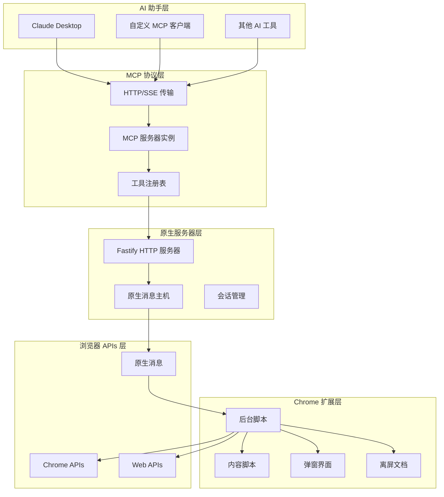

# Chrome MCP Server 架构设计 🏗️

本文档提供 Chrome MCP Server 架构、设计决策和实现细节的详细技术概述。

## 📋 目录

- [概述](#概述)
- [系统架构](#系统架构)
- [组件详情](#组件详情)
- [数据流](#数据流)
- [性能优化](#性能优化)
- [安全考虑](#安全考虑)

## 🎯 概述

Chrome MCP Server 是一个浏览器自动化平台，通过模型上下文协议 (MCP) 将 AI 助手与 Chrome 浏览器功能连接起来。架构设计目标：

- **高性能**：高效的流式 HTTP/SSE 传输、原生消息传递与极简轻量的运行时占用
- **可扩展性**：模块化工具系统，便于添加新功能
- **可靠性**：强大的错误处理和优雅降级
- **安全性**：沙盒执行和基于权限的访问控制

## 🏗️ 系统架构



## 🔧 组件详情

### 1. 原生服务器 (`app/native-server/`)

**目的**：MCP 协议实现和原生消息桥接

**核心组件**：

- **Fastify HTTP 服务器**：处理基于 HTTP/SSE 的 MCP 协议
- **原生消息主机**：与 Chrome 扩展通信
- **会话管理**：管理多个 MCP 客户端会话
- **工具注册表**：将工具调用路由到 Chrome 扩展

**技术栈**：

- TypeScript + Fastify
- MCP SDK (@modelcontextprotocol/sdk)
- 原生消息协议

### 2. Chrome 扩展 (`app/chrome-extension/`)

**目的**：浏览器自动化和 AI 助手桥接

**核心组件**：

- **后台脚本**：主要协调器和工具执行器
- **内容脚本**：页面交互和内容提取
- **弹窗界面**：用户配置和状态显示
- **离屏文档**：后台任务（GIF 编码、保活）

**技术栈**：

- WXT 框架 + Vue 3
- Chrome 扩展 APIs
- TypeScript

### 3. 共享包 (`packages/`)

#### 3.1 共享类型 (`packages/shared/`)

- 工具模式和类型定义
- 通用接口和工具
- MCP 协议类型

## 🔄 数据流

### 工具执行流程

```
┌─────────────┐    ┌──────────────┐    ┌─────────────────┐    ┌──────────────┐
│ AI 助手     │    │ 原生服务器   │    │ Chrome 扩展     │    │ 浏览器 APIs  │
└─────┬───────┘    └──────┬───────┘    └─────────┬───────┘    └──────┬───────┘
      │                   │                      │                   │
      │ 1. 工具调用       │                      │                   │
      ├──────────────────►│                      │                   │
      │                   │ 2. 原生消息          │                   │
      │                   ├─────────────────────►│                   │
      │                   │                      │ 3. 执行工具       │
      │                   │                      ├──────────────────►│
      │                   │                      │ 4. API 响应       │
      │                   │                      │◄──────────────────┤
      │                   │ 5. 工具结果          │                   │
      │                   │◄─────────────────────┤                   │
      │ 6. MCP 响应       │                      │                   │
      │◄──────────────────┤                      │                   │
```

## ⚡ 性能优化

### 1. 内存与资源管理

**策略**：

- **Offscreen 处理**：独立的 Offscreen 文档用于 GIF 编码与后台保活
- **垃圾回收**：显式清理大对象与捕获缓冲区
- **轻量精简**：移除沉重的端侧本地大模型和向量依赖，极大降低插件内存与 CPU 开销

### 2. 并发处理

- **网络捕获**：并行请求处理与非阻塞事件缓冲
- **Offscreen 文档**：后台 GIF 生成不阻塞扩展 Service Worker

## 🔧 扩展点

### 添加新工具

1. **定义模式** 在 `packages/shared/src/tools.ts`
2. **实现工具** 继承 `BaseBrowserToolExecutor`
3. **注册工具** 在工具索引中
4. **添加测试** 用于功能测试

### 协议扩展

1. **MCP 扩展** 用于自定义功能
2. **传输层** 用于不同通信方法
3. **身份验证** 用于安全连接
4. **监控** 用于性能指标

此架构使 Chrome MCP Server 能够在保持安全性和可扩展性的同时，提供高性能的浏览器自动化和先进的 AI 功能。
